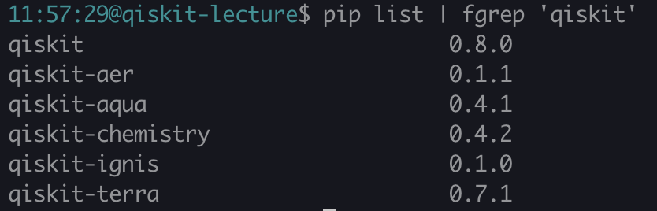

### Qiskit-tutorial

___
### B3 cocori
---
### What is Qiskit?
___
An open-source quantum computing framework for leveraging today's quantum processors in research, education, and business 

---
### How to install?
You can install qiskit by using pip!(or conda)  
`pip install qiskit`  
Check version!(now 0.8.0 and 0.7.1 terra)  
`<pip list | fgrep 'qiskit>`

