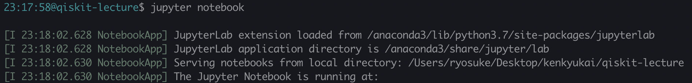

### Qiskit-tutorial

___

### B3 cocori

---

### What is Qiskit?
___
An open-source quantum computing framework for leveraging today's quantum processors in research, education, and business 
---
### How to install?
You can install qiskit by using pip!(or conda)  
`pip install qiskit`  
---
### **Check version!**  
Now, ~~0.8.0~~ 0.10.0 and 0.8.0 terra are available  
`pip list | fgrep 'qiskit'`  

---
### Access!
[My github](https://github.com/Chibikuri/qiskit-lecture)  
---
### Git clone

By using `git clone` command or download zip file, you can get my source code.
---

### Let's try!
Run script!
---

### Setup your IBMQ account!

Access [here](https://quantumexperience.ng.bluemix.net/qx/community)!

---

### login 

  
---

### API token

Get your api token!

(**DO NOT EXPOSURE**)  
---
Copy your api token and paste to API token in 

`test/Qconfig_IBMQ_experimence.py` 

and run  

`python test.py`

in `test/test.py`
---

If the result of `test.py` is like following, your setting is done.

---
### Hello qiskit!
Run `src/hello_qiskit.py`!  
---
### Qasm
Qasm is kind of assembly in quantum computing.  
You can make your quantum circuit by text.
---
### Jupyter notebook
If you don't have any environment for jupyter notebook, please access [here](https://colab.research.google.com/github/Chibikuri/qiskit-lecture/blob/master/src/simulators.ipynb).

If you have, just run `jupyter notebook`command in qiskit-lecture folder.
 
--- 

Open `qiskit-lecture/src/simulators.ipynb`
---