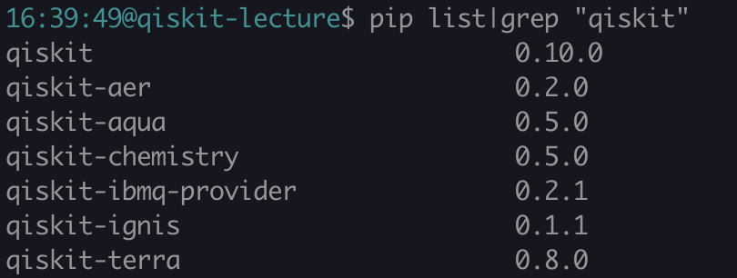

# qiskit-lecture
How to setup and use qiskit.

## Installation
You can install qiskit by using
`pip install qiskit`  
This is current version of qiskit and qiksit-terra.

## Register IBMQ
Access [here!](https://www.ibm.com/account/us-en/)  
Register IBMQ.  

If you have your own IBMQ account, please sign in.  
If you don't have, please sign up for it.
## Documents
[Qiskit](https://qiskit.org/)  
[Documents](https://qiskit.org/documentation/)  
[Python](https://docs.python.org/3/)